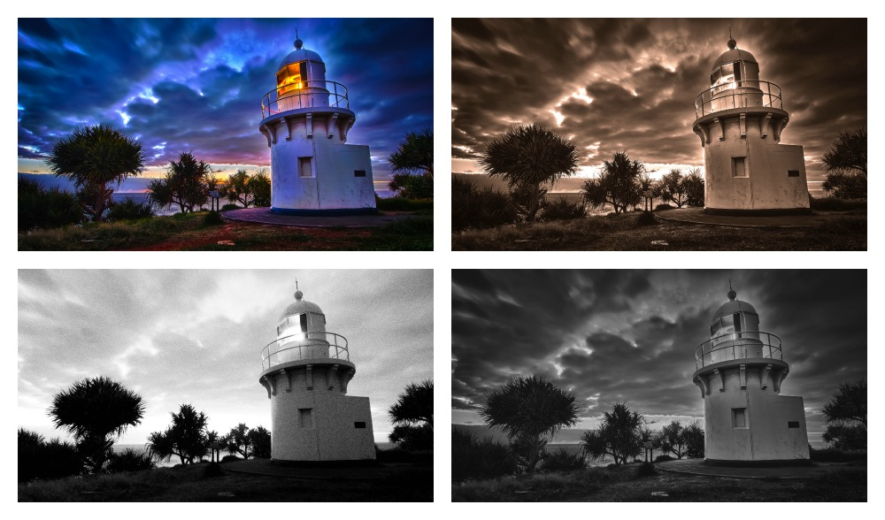
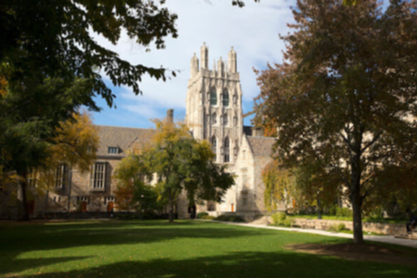
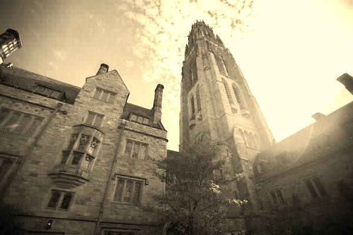
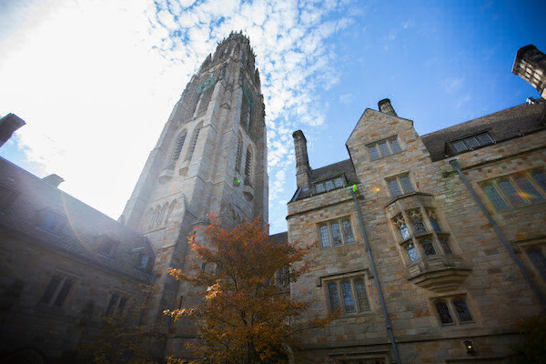

# Photo Filters Using C-Programming: 

## Scope & Purpose | Main Built-in Functionalities

* I wanted to further develop my proficiency in C, a lower level language, so I developed my own custom photo filters: Greyscale, Sepia, Reflection (Flipping the image), and Blur.

## System Prerequisites To Get Started

You will need the following installed on your computer system and import the following libraries:
* C
* Makefile

## Getting Started

* Download the repository
* Install Pre-requisites
* And run in an actual terminal, not a virtual one

## Code Review - Recruiters / Hiring Managers

* Please view the filter.c, helpers.c, helpers.h and bmp.h for all of core program, data structures, and algorithms

## Code Snippets

* Data Structures

* Grey Scale Filter Function

* Sepia Filter Function

* Reflection Filter Function

* Blur Filter Function

## Filter Program

## Output Examples - Before And With Filters

### Example 1)

* Courtyard Before

* Courtyard Greyscale

* Courtyard Sepia

* Courtyard Reflection

* Courtyard Blur

### Example 2)

* Tower Before

* Tower Greyscale

* Tower Sepia

* Tower Reflection

* Tower Blur

## Next Steps Considerations

* Develop more filters
* Expand to accept all file types: jpg, pngs, and etc.

### Personal Note

* Hope you enjoyed it. Thank you for your time!

## Author

* **Johneson Giang** - *Invidual Project* - [Github](https://github.com/jhustles)

## License

This project is licensed under the MIT License - see the [LICENSE.md](LICENSE.md) file for details

## Acknowledgments & Credits

* Shout out to David J. Mahlan & Brian Yu

